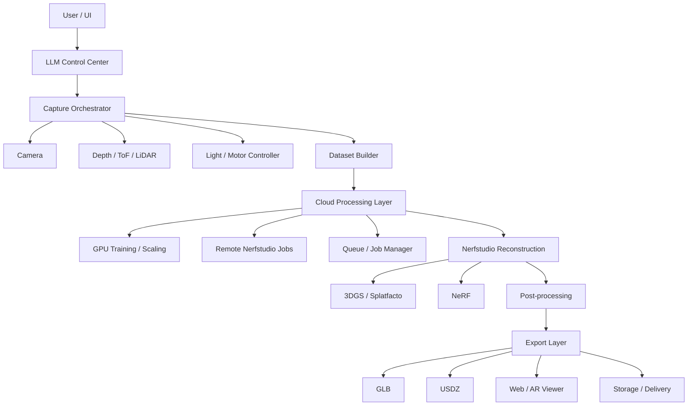

# ScanBox AI + Nerfstudio
## Технический документ

### 1. Назначение системы
ScanBox AI — это система для автоматизированной оцифровки объектов в 3D с последующим экспортом результатов для e-commerce, AR/VR и инженерных сценариев.

Цель проекта — превратить сырые данные с камеры и датчиков глубины в готовый цифровой актив:
- фотореалистичную 3D-модель,
- визуализацию для веба и мобильных устройств,
- экспортируемые форматы для AR,
- при необходимости — геометрически более точную реконструкцию объекта.

Nerfstudio предлагается использовать как основной модуль реконструкции и рендера. Он закрывает часть pipeline, связанную с построением сцены, обучением модели и визуализацией результата.

---

### 2. Цели проекта
1. Автоматизировать процесс захвата объекта.
2. Получать качественную 3D-реконструкцию без ручной настройки сложного пайплайна.
3. Поддерживать два режима восстановления:
   - быстрый фотореалистичный режим для коммерческого применения,
   - более точный режим для сложных поверхностей и инженерных задач.
4. Снизить требования к оператору за счет LLM-управления.
5. Упростить экспорт результата в форматы, пригодные для web и AR.

---

### 3. Нефункциональные требования
- **Автоматизация**: минимальное участие пользователя в процессе сканирования.
- **Модульность**: отдельные блоки для захвата, реконструкции, постобработки и экспорта.
- **Масштабируемость**: возможность заменить датчики, модели и форматы экспорта без переписывания всей системы.
- **Воспроизводимость**: одинаковый pipeline для одинаковых входных данных.
- **Практичность**: приоритет на сценарии, которые дают измеримую пользу для бизнеса.

---

### 4. Общая архитектура
Система делится на 4 слоя.

#### 4.0 Структурная схема


#### 4.1 Control Layer
Слой управления и оркестрации.

Компоненты:
- LLM-агент,
- интерфейс команд на естественном языке,
- контроллер сценариев сканирования,
- управление устройствами захвата.

Задачи слоя:
- интерпретация пользовательских команд,
- выбор режима сканирования,
- запуск и остановка пайплайна,
- передача параметров в нижележащие модули.

#### 4.2 Capture Layer
Слой получения данных.

Компоненты:
- RGB-камера,
- датчик глубины / ToF / LiDAR,
- поворотный стол,
- освещение,
- контроллер оборудования (например, ESP32 / Arduino / Raspberry Pi).

Задачи слоя:
- синхронный захват изображений и глубины,
- стабилизация условий съемки,
- контроль положения объекта,
- формирование набора наблюдений для реконструкции.

#### 4.3 Reconstruction Layer
Слой нейросетевой реконструкции.

Компоненты:
- Nerfstudio,
- 3D Gaussian Splatting,
- NeRF,
- модули предобработки точек и изображений,
- постобработка геометрии.

Задачи слоя:
- обучение модели по данным сцены,
- восстановление визуального представления объекта,
- генерация точек обзора и рендера,
- при необходимости — экспорт в mesh.

#### 4.4 Cloud Processing Layer
Слой облачной или удаленной вычислительной обработки.

Компоненты:
- GPU-серверы для обучения NeRF/3DGS,
- очередь задач,
- менеджер ресурсов,
- удаленный запуск Nerfstudio jobs,
- хранилище промежуточных артефактов.

Задачи слоя:
- вынос тяжелого обучения с локального устройства,
- масштабирование под разные сцены и загрузку,
- очередность обработки нескольких объектов,
- контроль статуса job'ов и возврат результатов.

#### 4.5 Product Layer
Слой выдачи результата.

Компоненты:
- экспорт в GLB / USDZ,
- web viewer,
- AR-viewer,
- генерация embed-кода,
- хранение артефактов сканирования.

Задачи слоя:
- подготовка результата под внешние площадки,
- визуализация в каталоге товаров,
- доставка результата пользователю или в CMS.

---

### 5. Роль Nerfstudio в системе
Nerfstudio используется как ядро reconstruction pipeline.

Он подходит для:
- обучения scene representation на базе фото и видео,
- генерации фотореалистичных превью,
- работы с несколькими NeRF/3DGS методами,
- быстрой смены модели без переписывания всей логики.

#### Предпочтительный метод для старта
Для MVP рекомендуется начать с **Splatfacto / 3D Gaussian Splatting**:
- быстрее обучается,
- дает хороший визуальный результат,
- удобен для коммерческого превью,
- подходит для web и mobile-first сценариев.

#### Второй режим
**NeRF** нужен как режим повышенного качества для сцен:
- с бликами,
- со стеклом,
- с полупрозрачными материалами,
- с нестандартным освещением.

---

### 6. Поток данных
Типовой поток работы:

1. Пользователь задает команду.
2. LLM-агент интерпретирует цель сканирования.
3. Контроллер запускает захват.
4. Камера и датчики собирают данные объекта.
5. Данные сохраняются в рабочий набор сцены.
6. Dataset Builder подготавливает пакет для локальной или облачной обработки.
7. Cloud Processing Layer при необходимости отправляет job на GPU-сервер.
8. Nerfstudio получает изображения и связанные метаданные.
9. Выполняется обучение модели.
10. Система рендерит превью и финальный результат.
11. Результат экспортируется в нужный формат.
12. Артефакты отправляются в хранилище или интерфейс публикации.

---

### 7. Сценарии использования
#### 7.1 E-commerce сканирование
Цель: получить красивую модель товара для карточки.

Требования:
- быстрый захват,
- фотореализм,
- минимальная ручная настройка,
- экспорт в GLB / просмотр в браузере.

#### 7.2 AR-просмотр
Цель: дать пользователю возможность открыть объект в дополненной реальности.

Требования:
- экспорт в USDZ / GLB,
- корректный scale,
- стабильная визуализация на мобильных устройствах.

#### 7.3 Инженерная оцифровка
Цель: получить более точную форму объекта.

Требования:
- использование depth-данных,
- контроль масштаба,
- возможность постобработки mesh.

---

### 8. Данные и хранение
#### 8.1 Входные данные
- изображения RGB,
- depth / ToF / LiDAR данные,
- параметры съемки,
- данные движения стола и освещения,
- метаданные сессии.

#### 8.2 Выходные данные
- реконструированная сцена,
- рендеры предпросмотра,
- mesh или splats,
- экспортируемые файлы GLB / USDZ,
- журналы обработки,
- результаты анализа качества.

#### 8.3 Хранилище
Рекомендуется разделить хранилище на:
- **raw** — сырые данные,
- **processed** — предобработанные данные,
- **models** — результаты обучения,
- **exports** — финальные артефакты,
- **logs** — логи сессий.

---

### 9. Интерфейсы между модулями
#### 9.1 LLM → Controller
Формат: структурированная команда.

Пример:
```json
{
  "task": "scan_object",
  "mode": "ecommerce",
  "object_name": "sneaker",
  "quality": "fast"
}
```

#### 9.2 Controller → Capture
Формат: параметры сканирования.

Пример:
```json
{
  "rotation_steps": 72,
  "light_profile": "softbox",
  "camera_exposure": 0.01,
  "depth_enabled": true
}
```

#### 9.3 Capture → Reconstruction
Формат: сцена с данными.

Состав:
- папка с изображениями,
- depth maps,
- calibration files,
- metadata JSON.

#### 9.4 Reconstruction → Export
Формат: модель, текстуры, превью, технические метаданные.

---

### 10. Выбор технологий
#### 10.1 Основной стек
- Python,
- Nerfstudio,
- PyTorch,
- OpenCV,
- FastAPI или Flask для сервиса,
- SQLite / PostgreSQL для метаданных,
- object storage для файлов,
- Docker для упаковки.

#### 10.2 Железо
- камера с автофокусом,
- ToF / LiDAR сенсор,
- поворотный стол,
- контроллер ESP32 / Arduino,
- Raspberry Pi или другой мини-компьютер для orchestration.

#### 10.3 Опциональные компоненты
- очередь задач,
- GPU-сервер для обучения,
- web viewer на Three.js / Babylon.js,
- сервис генерации окружений и сцен.

---

### 11. MVP-план
#### Этап 1
Сделать рабочий минимальный pipeline:
- камера,
- поворотный стол,
- захват фото,
- запуск Nerfstudio,
- экспорт результата.

#### Этап 2
Добавить:
- depth-сенсор,
- контроль освещения,
- автоматическую предобработку,
- хранение сессий.

#### Этап 3
Подключить LLM-оркестрацию:
- управление на естественном языке,
- выбор режима,
- подсказки по качеству захвата.

#### Этап 4
Добавить продуктовый слой:
- web preview,
- AR export,
- embed-код,
- интеграцию с каталогом.

---

### 12. Основные риски
1. **Качество данных** — плохой захват сильнее всего портит результат.
2. **Сложные материалы** — стекло, металл, отражающие поверхности.
3. **Стабильность обучения** — разные сцены могут требовать разных параметров.
4. **Сложность интеграции железа** — камера, вращение и свет должны быть синхронизированы.
5. **Перегрузка scope** — попытка сразу сделать и 3DGS, и NeRF, и LLM, и AR может замедлить MVP.

---

### 13. Рекомендация по стратегии
Для практической реализации лучше выбрать такой порядок:

1. Сначала получить стабильный capture pipeline.
2. Потом подключить Nerfstudio как основной reconstruction engine.
3. Затем сделать экспорт и просмотр результата.
4. После этого добавить LLM-управление и автоматизацию.
5. Только потом усложнять систему depth fusion, scene generation и product integration.

---

### 14. Итог
Nerfstudio подходит для ScanBox AI как центральный модуль реконструкции.

Лучший практический сценарий — использовать его не как весь продукт, а как ядро внутри более широкой системы:
- LLM управляет процессом,
- железо собирает данные,
- Nerfstudio строит 3D-результат,
- отдельный слой упаковывает и публикует итог.

Это дает хороший баланс между скоростью, качеством и расширяемостью.
